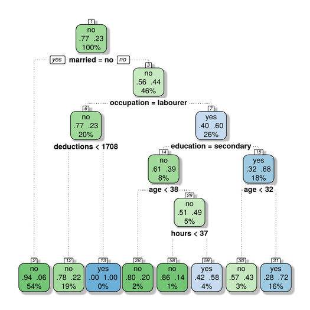

Predicting Financial Audit Outcome
==================================

This [MLHub](https://mlhub.ai) package contains a decision tree model
from the [Rattle](https://rattle.togaware.com) package for
[R](https://r-project.org). It is used in the
[Rattle](https://bit.ly/rattle_data_mining) book to demonstrate a
classification model use-case in financial audit.  A sample dataset of
audit outcomes is used to train the model to predict the outcome of
audits. A successful audit identifies missing or incorrectly reported
financial data.

A classification (decision) tree model to represent the discovered
knowledge is built using a recursive partitioning algorithm. Decision
trees are recognised as an easily understandable representation of the
discovered knowledge. They are widely popular in situations where
insight and explanations are important.

Visit the github repository for more details:
<https://github.com/gjwgit/audit>

Usage
-----

- To install mlhub

```console
$ pip3 install mlhub
```

- To install and run the pre-built model:

```console
$ ml install   audit
$ ml configure audit
$ ml demo      audit
```

Demonstration
-------------

```console
$ ml demo audit
=========================
Audit Decision Tree Model
=========================

A common machine learning task is classification where we classify people,
for example, into two classes. A decision tree model can be trained to
predict whether a person belongs to one class or the other. In this MLHub
package a pre-built decision tree model is loaded to predict the likely
outcome of a financial audit of a tax payer, as an example.

Press Enter to continue: 

=================================
Textual Presentation of the Model
=================================

The textual presentation of the model is the default output from the R package
for decision trees. It begins with a record of the number of observations
used to build the model (n=). The following two lines of text are a legend
to assist with the interpretation of the tree.

n= 2000 

node), split, n, loss, yval, (yprob)
      * denotes terminal node

 1) root 2000 463 no (0.76850000 0.23150000)  
   2) married=no 1083  61 no (0.94367498 0.05632502) *
   3) married=yes 917 402 no (0.56161396 0.43838604)  
     6) occupation=labourer 396  92 no (0.76767677 0.23232323)  
      12) deductions< 1708 389  85 no (0.78149100 0.21850900) *
      13) deductions>=1708 7   0 yes (0.00000000 1.00000000) *
     7) occupation=office 521 211 yes (0.40499040 0.59500960)  
      14) education=secondary 155  61 no (0.60645161 0.39354839)  
        28) age< 37.5 50  10 no (0.80000000 0.20000000) *
        29) age>=37.5 105  51 no (0.51428571 0.48571429)  
          58) hours< 37 22   3 no (0.86363636 0.13636364) *
          59) hours>=37 83  35 yes (0.42168675 0.57831325) *
      15) education=tertiary 366 117 yes (0.31967213 0.68032787)  
        30) age< 31.5 53  23 no (0.56603774 0.43396226) *
        31) age>=31.5 313  87 yes (0.27795527 0.72204473) *

Press Enter to continue: 

=============
Decision Tree
=============

A visual representation of a model can often be more insightful than the
textual representation. For a decision tree model, representing the
discovered knowledge as a decision tree, we read the tree from top to
bottom, traversing the path corresponding to the answer to the question
presented at each node. The leaf node has the final decision together with
the class probabilities.

Press Enter to display the decision tree: 
```



```console
Close the graphic window using Ctrl-w.

Press Enter to continue: 

===================
Variable Importance
===================

An understanding of the relative importance of each of the variables
adds further insight into the data. The actual numeric values mean little
but the relativities are significant.

Press Enter to display the plot: 

Close the graphic window using Ctrl-W.

Press Enter to continue: 

=====================
Predict Audit Outcome
=====================

We can use this model to predict the outcome of an audit. Below we show the
predictions after applying the pre-built decision tree model to a random
subset of a dataset of previously unseen audit case outcomes. This provides
an insight into the expected future performance of the model when we decide
to deploy the model into a production system.

   Actual Predicted Error
1     yes       yes      
2      no        no      
3      no        no      
4     yes        no <----
5      no        no      
6      no        no      
7      no        no      
8     yes        no <----
9     yes        no <----
10     no        no      
11    yes        no <----
12    yes       yes      

Press Enter to continue: 

================
Confusion Matrix
================

A confusion matrix summarises the performance of the model on this evluation
dataset. All figures in the table are percentages and are calculated across
the predicitions made by the model for each observation and compared to the
actual or known values of the target variable. The first column reports the
true negative and false negative rates whilst the second column reports the
false positive and true positive rates.

The Error column calculates the error across each class. We also report the
overall error which is calculated as the number of errors over the number of
observations. The average of the class errors is also reported. 

      Predicted
Actual   no  yes Error
   no  72.8  5.8   7.4
   yes  8.5 12.8  39.8

Overall error: 14%
Average class error: 24%

Press Enter to continue: 

==========
Risk Chart
==========

A risk chart presents a cumulative performance view of the model.

The x-axis is the percentage of caseload as we progress (left to right)
through cases from the highest probability of an adjustment being made to
the financial data to the lowest probability of an adjustment.

The y-axis is the expected performance of the model in selecting customers
to audit. It is the percentage of the known positive outcomes that are
predicted by the model for the given caseload (the recall).

To deploy the model the decision maker will trade recall against caseload
in accordance with availalbe auditing resources and risk tolerance.

The more area under the curve (both adjusted and adjustment) the better
the model performance. A perfect model would follow the grey line (for
adjusted) and the pink line (for adjustment). The Precision line represents
the lift offered by the model, with the lift values on the right hand axis.

Press Enter to display the risk chart: 

Close the graphic window using Ctrl-w.

```
